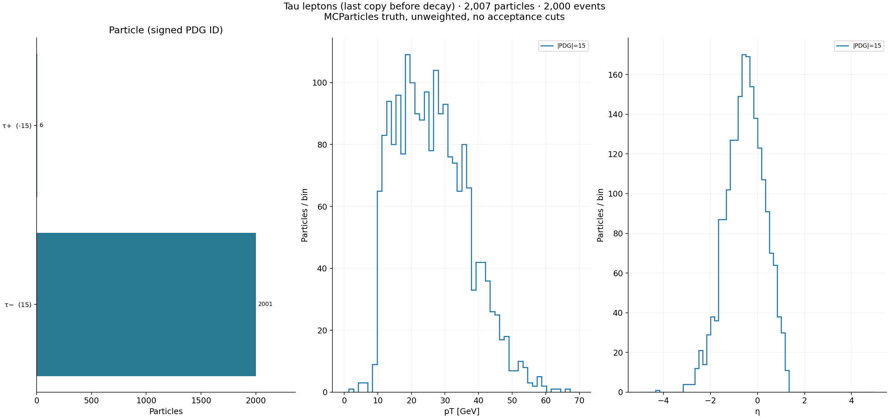
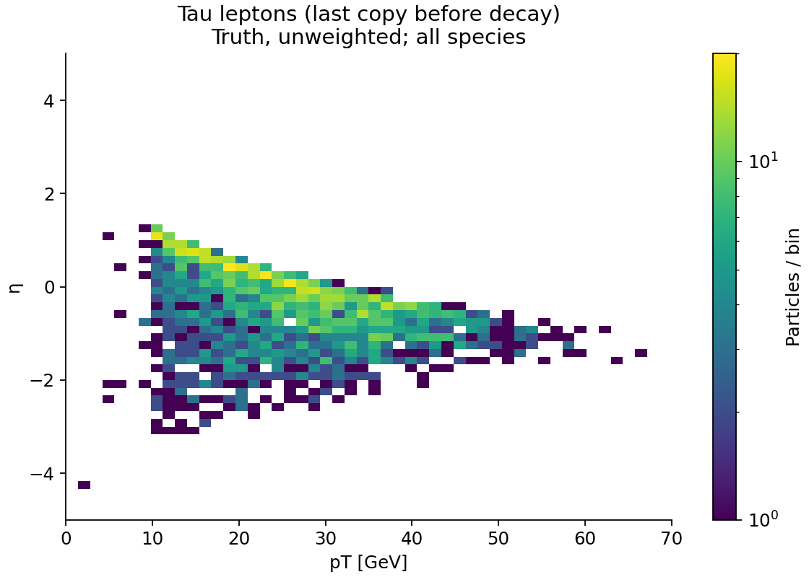
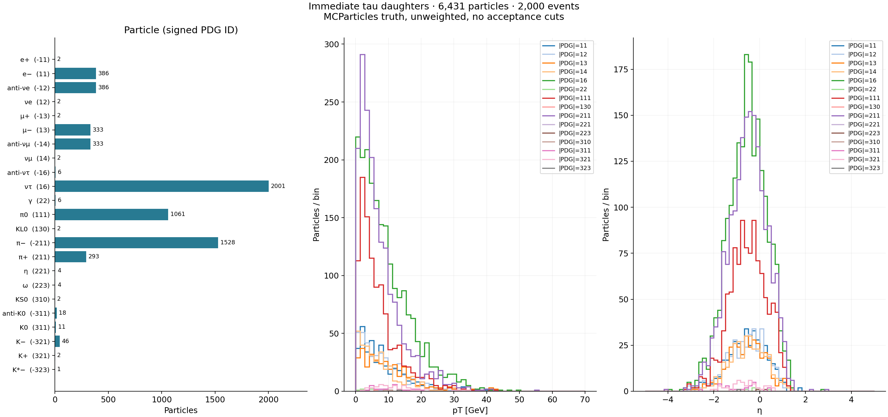
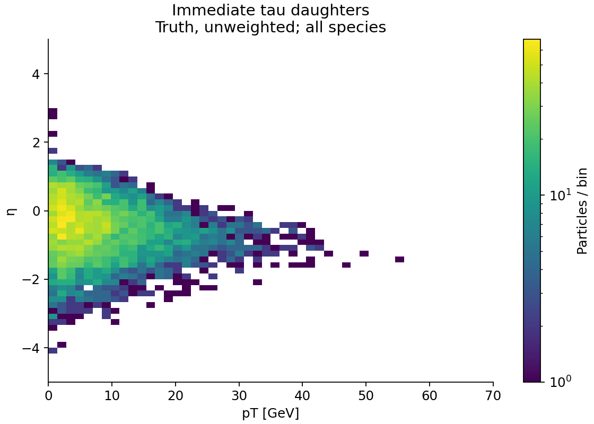
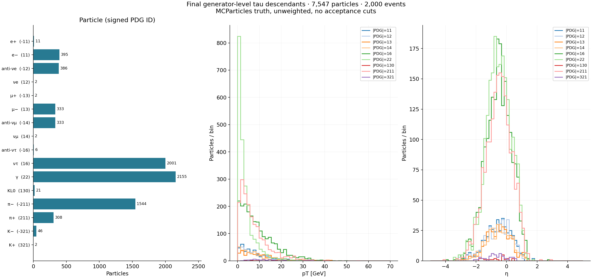
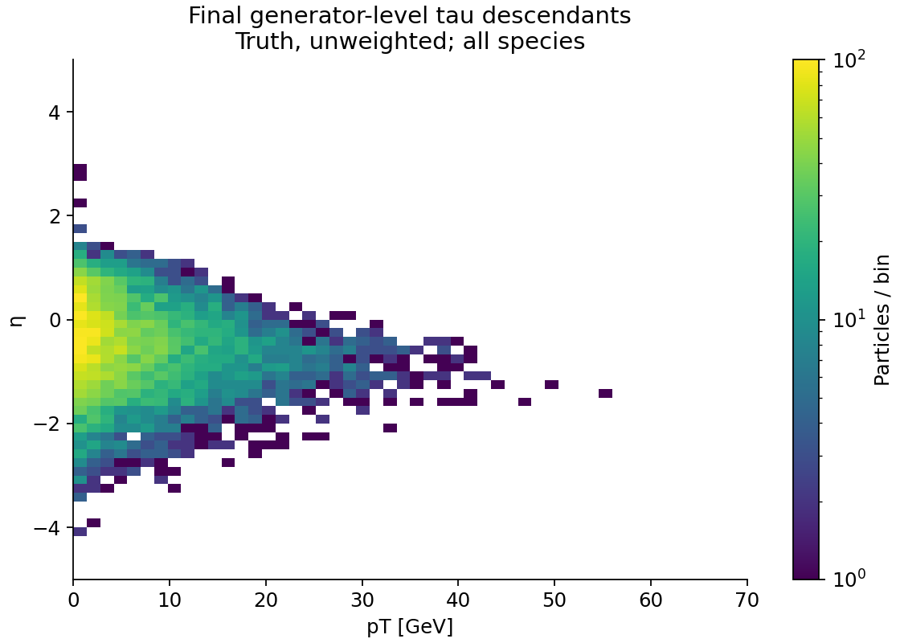

# Tau analysis: two-file example

Analyzed 2,000 events in exactly 2 files. Selected 2,007 generator taus.

## Definition

Last tau copy before decay; truth momenta in the stored MCParticles frame. No acceptance cuts. Unweighted particle counts, not cross sections. PID is the MC PDG identity, not detector PID. Direct daughters and final status-1 descendants are separate samples. Neutrinos are included. Traversal stops at status 1; status-0 simulation secondaries are excluded from all decay links. The tau sample is inclusive, including any secondary generator taus; no hard-process tag is imposed.

## Validation

- MC link indices, collection IDs and reciprocal links: passed.
- Tau status counts: {2: 2007, 23: 1075, 44: 297}.
- Tau copies removed: 1372.
- Taus without daughters: 0.
- Unresolved descendant leaves: 0.
- Maximum direct-decay four-momentum component residual: 0.0302817 GeV.
- Maximum direct-decay charge residual: 0.
- Maximum residual using tau endpoint momentum: 0.0302817 GeV.
- 376 decays have a production-momentum component residual above 1 MeV. This is a diagnostic flag, not a failed ancestry check.
- Endpoint momentum does not resolve the largest discrepancy in these files. Its cause is not established; inspect generator/transport records before precision decay-closure studies.
- Histogram totals including nonfinite entries and overflow: passed.

## Figures

## Signed daughter IDs

| Level | PDG ID | Particle | Count |
|---|---:|---|---:|
| tau | -15 | τ+ | 6 |
| tau | 15 | τ− | 2001 |
| direct | -11 | e+ | 2 |
| direct | 11 | e− | 386 |
| direct | -12 | anti-νe | 386 |
| direct | 12 | νe | 2 |
| direct | -13 | μ+ | 2 |
| direct | 13 | μ− | 333 |
| direct | -14 | anti-νμ | 333 |
| direct | 14 | νμ | 2 |
| direct | -16 | anti-ντ | 6 |
| direct | 16 | ντ | 2001 |
| direct | 22 | γ | 6 |
| direct | 111 | π0 | 1061 |
| direct | 130 | KL0 | 2 |
| direct | -211 | π− | 1528 |
| direct | 211 | π+ | 293 |
| direct | 221 | η | 4 |
| direct | 223 | ω | 4 |
| direct | 310 | KS0 | 2 |
| direct | -311 | anti-K0 | 18 |
| direct | 311 | K0 | 11 |
| direct | -321 | K− | 46 |
| direct | 321 | K+ | 2 |
| direct | -323 | K*− | 1 |
| stable | -11 | e+ | 11 |
| stable | 11 | e− | 395 |
| stable | -12 | anti-νe | 386 |
| stable | 12 | νe | 2 |
| stable | -13 | μ+ | 2 |
| stable | 13 | μ− | 333 |
| stable | -14 | anti-νμ | 333 |
| stable | 14 | νμ | 2 |
| stable | -16 | anti-ντ | 6 |
| stable | 16 | ντ | 2001 |
| stable | 22 | γ | 2155 |
| stable | 130 | KL0 | 21 |
| stable | -211 | π− | 1544 |
| stable | 211 | π+ | 308 |
| stable | -321 | K− | 46 |
| stable | 321 | K+ | 2 |

## Inputs

- `bsm_ceu_275x18_100K_wo_PhotonRad_ab_0000.edm4hep.root`
- `bsm_ceu_275x18_100K_wo_PhotonRad_ab_1000.edm4hep.root`

## Interpretation limits

These two files are a limited sample. No detector reconstruction efficiency or PID performance is inferred. Decay-channel fractions describe this sample and are not a branching-fraction measurement. Filename beam energies/process labels have not been independently established from generator settings. Input files remain read-only.

## Reproduce this example

See [setup and run instructions](../README.md). The input files are not distributed with this repository. This is a saved local run, not output generated by GitHub Actions. File paths in this published copy are reduced to basenames.
