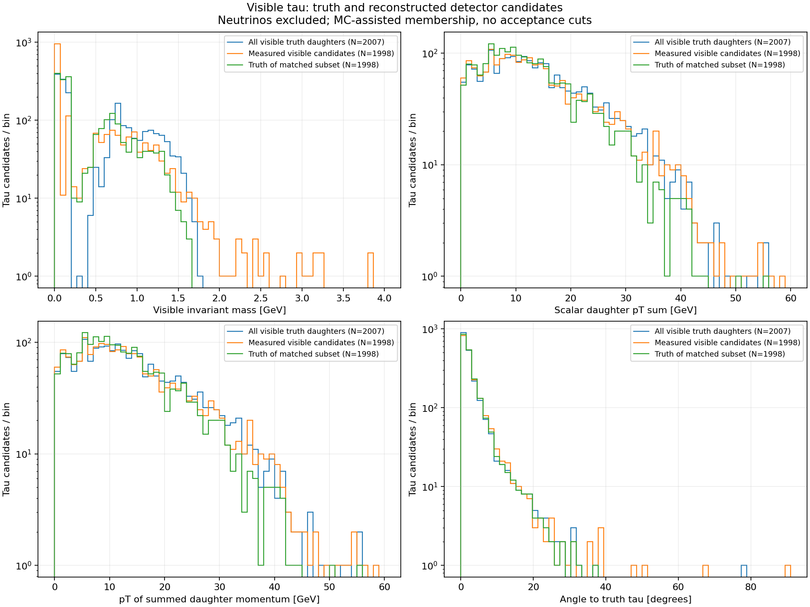
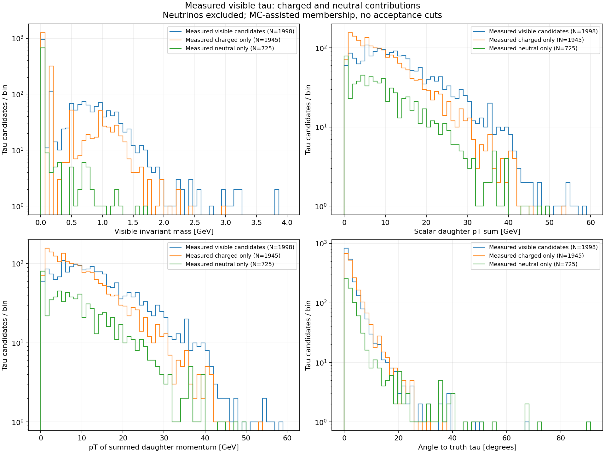
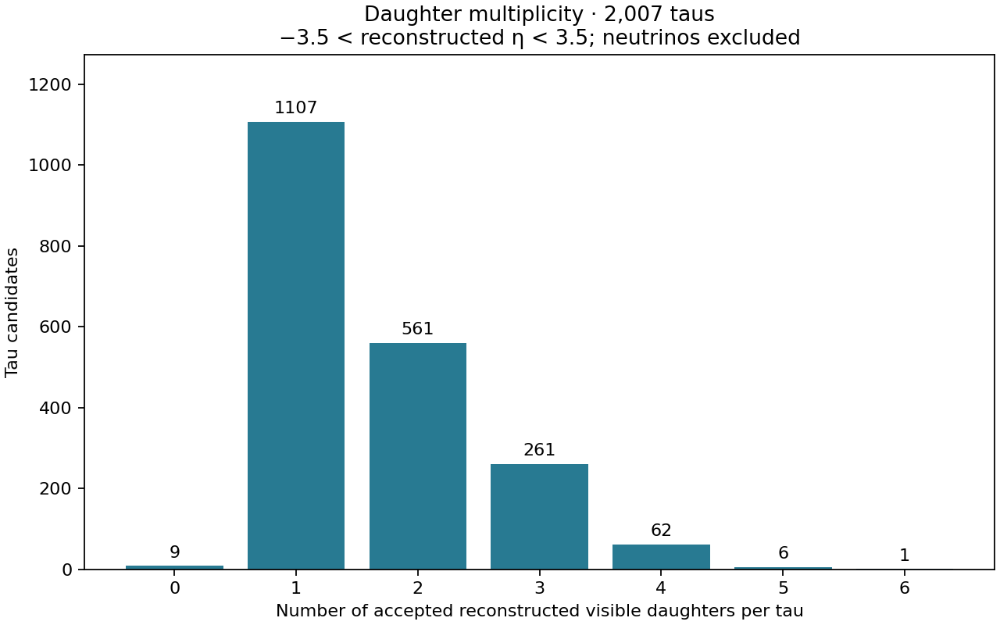
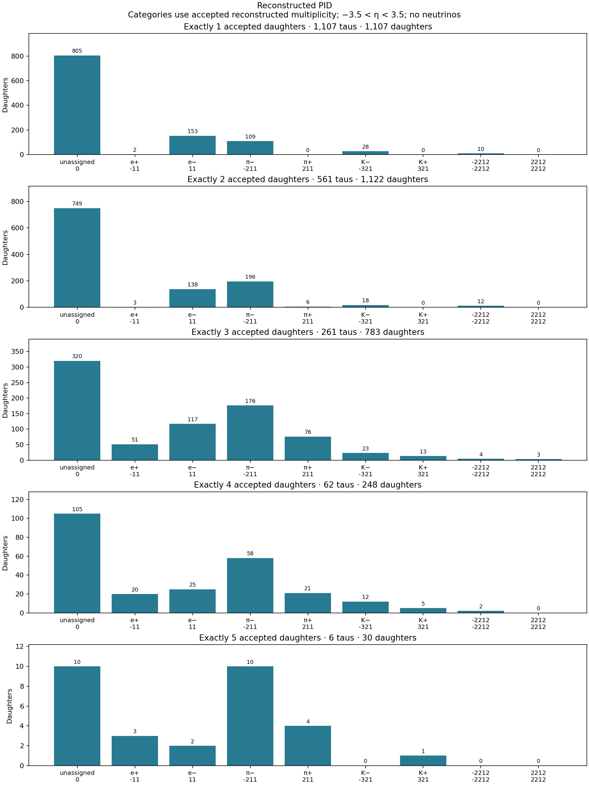
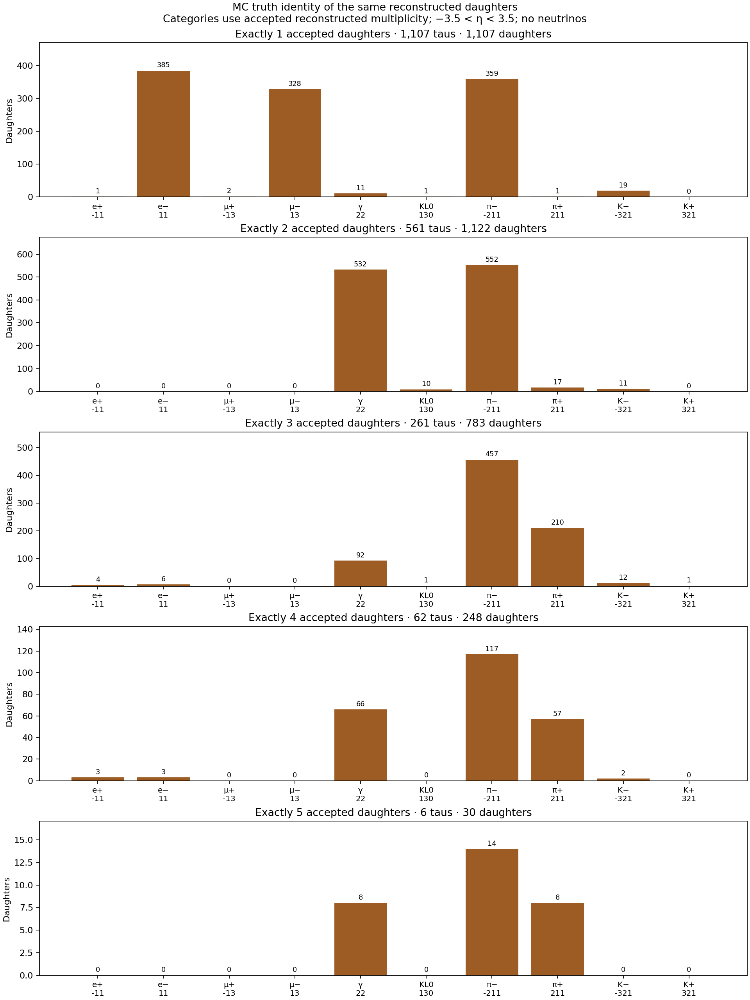

# Reconstructed visible tau analysis

Analyzed 2,000 events and 2,007 last-copy taus in two input files.

**Measured momenta and energies are used; MC truth provides tau membership and the reference tau direction. This is a simulation performance study, not a data-only tau reconstruction.**

## Definitions

- Visible mass: `sqrt((sum E)^2 - |sum p|^2)`.
- Scalar pT sum: `sum sqrt(px^2 + py^2)`; vector-sum pT: `sqrt((sum px)^2 + (sum py)^2)`.
- Opening angle: the three-dimensional angle between the truth tau production momentum and the summed reconstructed daughter momentum, in degrees.
- Charged candidates use track momentum and the stored reconstructed mass hypothesis. Neutral candidates use stored energy, direction and mass hypothesis; mass-zero candidates have p = E.
- Electron-, muon- and tau-neutrinos and antineutrinos are excluded. pi0 contributes through matched final photons; its parent four-vector is not added.
- No match: no reconstructed constituent. Empty systems have undefined mass/angle, zero sums in CSV, and are excluded from plotted distributions.
- One combined reconstructed collection avoids counting the separate charged collection twice. Duplicate truth matches prefer tracks, then larger association weight, then lower index.

## Counts

| Quantity | Count |
|---|---:|
| events | 2000 |
| taus | 2007 |
| reco_candidates_all_events | 36265 |
| duplicate_reco_matches_all_events | 17 |
| reco_with_multiple_truth_links | 0 |
| unresolved_generator_leaves | 0 |
| neutrinos_excluded | 2730 |
| visible_truth_daughters | 4817 |
| reco_charged | 2512 |
| charged_candidates_without_assigned_pid | 1206 |
| calorimeter_only_charged_truth | 62 |
| reco_neutral | 787 |
| invalid_reco_fourvectors | 0 |
| taus_with_reco | 1998 |
| taus_all_visible_matched | 1152 |
| visible_reco_daughters | 3299 |
| intermediate_generator_matches_omitted | 1 |

## Reconstructed visible observables (at least one candidate)

| Observable | Mean | Median |
|---|---:|---:|
| Visible invariant mass [GeV] | 0.44316 | 0.13957 |
| Scalar daughter pT sum [GeV] | 14.074 | 12.084 |
| pT of summed daughter momentum [GeV] | 14.068 | 12.076 |
| Angle to truth tau [degrees] | 3.3509 | 1.9121 |

## Limitations

- Not a data-only tau tagger; tau direction and daughter membership use MC truth.
- Neutral candidates are not identified pi0 particles; photons are counted individually, without also adding parent pi0.
- Missing/unmatched daughters are not filled using truth. Kinematic plots have no acceptance cuts; daughter multiplicity/PID plots require strict reconstructed |eta|<3.5. No event weights.
- Intermediate-generator and simulation-secondary associations are omitted; final status-1 matches define the sample.
- A calorimeter-only match to charged truth is retained as a measured neutral candidate under its stored mass hypothesis.
- Split showers/duplicate tracks reduced to one candidate per truth; merging and misassociation can bias observables.
- Visible invariant mass is not the full tau mass because neutrinos are missing.
- Unassigned reconstructed PID (PDG=0) is common; stored mass hypotheses are used, never substituted with truth PID masses.

## Accepted daughter multiplicity and PID

The following plots require −3.5 < reconstructed daughter eta < 3.5. Neutrinos remain excluded. Count is per tau, not per event; zero-daughter taus are retained. Photons from pi0 decays count individually. The earlier kinematic plots keep their original selection.

| Accepted daughters | Taus |
|---:|---:|
| 0 | 9 |
| 1 | 1107 |
| 2 | 561 |
| 3 | 261 |
| 4 | 62 |
| 5 | 6 |
| 6 | 1 |

PID plots count particles in each exact multiplicity category. PDG 0 means unassigned, not a neutrino. Truth identity is shown for the same accepted reconstructed candidates; it is not detector PID performance. Each PID panel sums to multiplicity times the number of taus in its category.

## Validation

Association collection IDs and bounds, reciprocal MC ancestry, and histogram accounting passed. Undefined mass/angle cases are explicitly counted. Focused unit tests cover four-vector sums and duplicate matching.

## Inputs

- `bsm_ceu_275x18_100K_wo_PhotonRad_ab_0000.edm4hep.root`
- `bsm_ceu_275x18_100K_wo_PhotonRad_ab_1000.edm4hep.root`

Saved local two-file run; inputs are not distributed. See [run instructions](../../README.md#reconstructed-visible-tau-observables).
